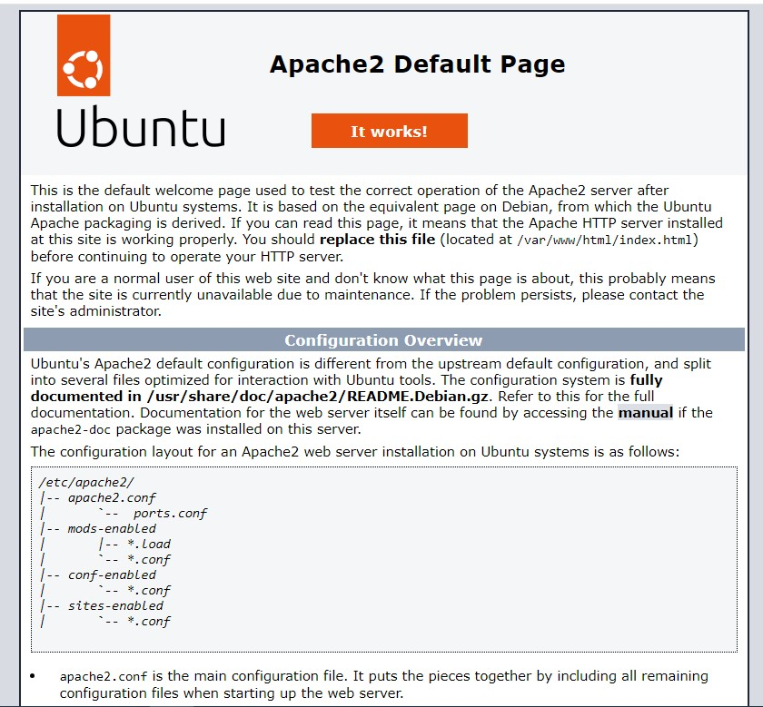
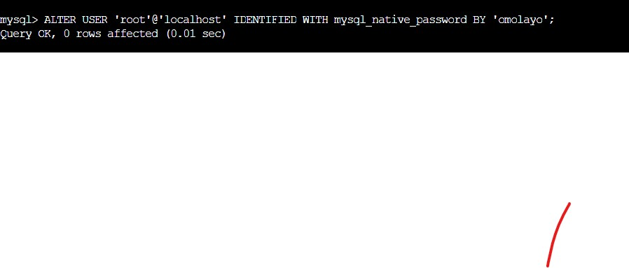

# Apache

# How To Install Linux, Apache, MySQL, PHP (LAMP) Stack on Ubuntu 22.04

## Project Overview

This project aims to develop a web-based application using the LAMP stack. The LAMP (Linux, Apache, MySQL, PHP/Perl/Python) stack is a popular open-source web development platform used for building dynamic websites and web applications.

## Prerequisites

- AWS EC2 Instance: An EC2 instance will be used as the hosting environment for the LAMP stack. It provides scalability and flexibility for web development projects.

- AWS Security Group Configuration: Ensure that all traffic is allowed in the AWS Security Group associated with your EC2 instance. However, this is not a recommended practice for production environments, and security configurations should be adjusted accordingly.

- Choose Ubuntu OS: Select Ubuntu as the operating system when configuring your EC2 instance. Ubuntu is widely used and well-supported, making it a suitable choice for hosting web applications.

## Step-by-Step Implementation

### Step 1 - Installing Apache

- Update package manager

```
sudo apt update
```

- Install Apache2 webserver

```
sudo apt install apache2
```

You’ll be prompted to confirm Apache’s installation. Confirm by pressing Y, then ENTER

- After installation, verify the status of Apache

```
sudo apt install apache2
```


- Test Apache's installation by accessing your server’s public IP address in your web browser

```
http://your_server_ip
```



## Step 2 — Installing MySQL

Now that Apache web server is up and running, a database system needs to be installed to store and manage data for your site. MySQL is a popular database management system used within PHP environments.

- Install MySQL Server

```
sudo apt install mysql-server
```

When prompted, confirm installation by typing Y, and then ENTER.

When the installation is finished, it’s recommended that you run a security script that comes pre-installed with MySQL. This script will remove some insecure default settings and lock down access to your database system.

- Open up MYSQL Prompt

```
sudo mysql
```


- Then run the following ALTER USER command to change the root user’s authentication method to one that uses a password. The following example changes the authentication method to mysql_native_password:

```
ALTER USER 'root'@'localhost' IDENTIFIED WITH mysql_native_password BY 'omolayo';
```



- After making this change, exit the MySQL prompt:

```
exit
```

- Start the interactive script by running:

```
sudo mysql_secure_installation
```


This will ask if you want to configure the VALIDATE PASSWORD PLUGIN.

Note: Enabling this feature is something of a judgment call. If enabled, passwords which don’t match the specified criteria will be rejected by MySQL with an error. It is safe to leave validation disabled, but you should always use strong, unique passwords for database credentials.

When prompted, confirm installation by typing Y, and then ENTER to series of question regarding removal of anonymous user and test database.

## Step 3 — Installing PHP

Having installed Apache to serve content and MySQL to store and manage data, PHP is next component of which processes code to display dynamic content to the end user. In addition to the php package, we will install php-mysql, a PHP module that allows PHP to communicate with MySQL-based databases and also install libapache2-mod-php to enable Apache to handle PHP files.

- To install these packages, run the following command:

```
sudo apt install php libapache2-mod-php php-mysql
```

- After installation, verify the PHP version:

```
php -v
```

**Output**


LAMP stack is now fully operational, but before testing the setup with a PHP script, it’s best to set up a proper Apache Virtual Host to hold your website’s files and folders.

## Step 4 — Creating a Virtual Host for your Website

When using the Apache web server, you can create virtual hosts to encapsulate configuration details and host more than one domain from a single server. we’ll set up a domain called lamp.

Apache on Ubuntu 22.04 has one virtual host enabled by default that is configured to serve documents from the /var/www/html directory. While this works well for a single site, it can become unwieldy if you are hosting multiple sites. Instead of modifying /var/www/html, we’ll create a directory structure within /var/www for the lamp site, leaving /var/www/html in place as the default directory to be served if a client request doesn’t match any other sites.

- Create the directory for Lamp domain as follows:

```
sudo mkdir /var/www/Layomi
```

- Next, assign ownership of the directory with the $USER environment variable, which will reference your current system user:

```
sudo chown -R $USER:$USER /var/www/Layomi
```

- Then, open a new configuration file in Apache’s sites-available directory using your preferred command-line editor. Here, we’ll use vim.

```
sudo vim /etc/apache2/sites-available/Layomi.conf
```

- This will create a new blank file. Add in the following bare-bones configuration with your own domain name:

```
<VirtualHost *:80>
    ServerName Layomi
    ServerAlias www.Layomi
    ServerAdmin webmaster@localhost
    DocumentRoot /var/www/Layomi
    ErrorLog ${APACHE_LOG_DIR}/error.log
    CustomLog ${APACHE_LOG_DIR}/access.log combined
</VirtualHost>
```


Save and close the file when you’re done. If you’re using vim, do that by pressing escape, :wq then ENTER.

complete